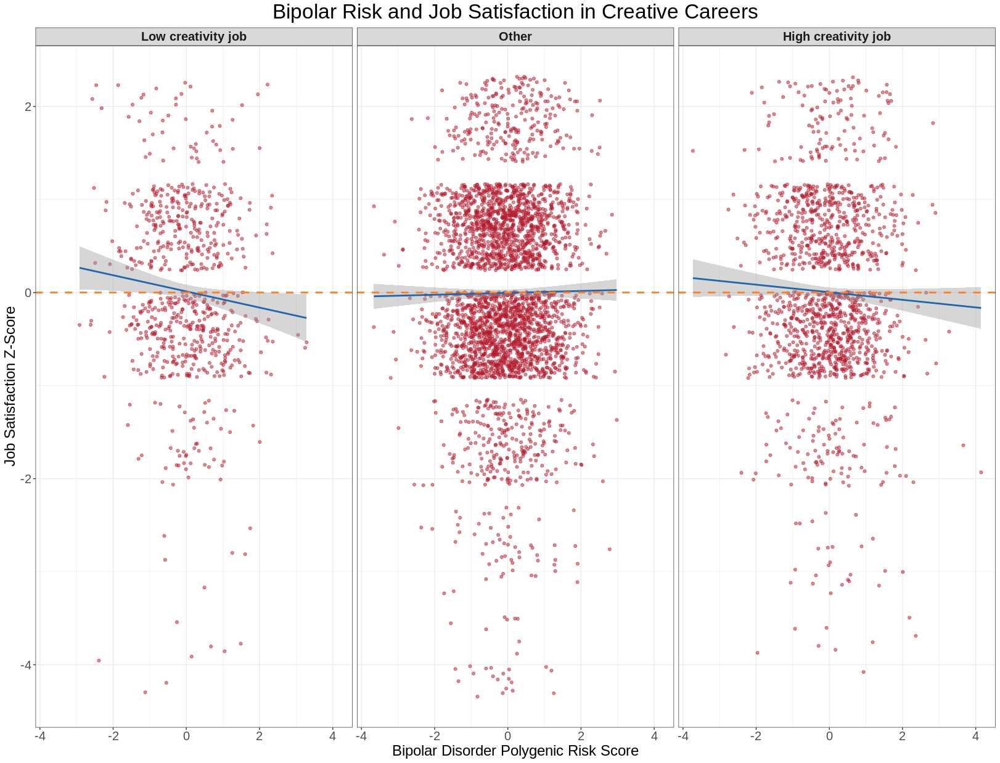

## Introduction

Creativity and bipolar disorder have had a long history of association. Many famous writers and other 'geniuses' such as Sylvia Plath and Vincent Van Gough are suspected to have had mood disorders based on anecdotal accounts of their lives. One of the first empirical studies of their relationship, spearheaded by former UI researcher Nancy Andreasen, found significantly higher rates of bipolar disorder in participants of the acclaimed Iowa Writer's Workshop compared to a control group.^1^ Previous research has defined a person as 'creative' in several ways--membership in a creative organization, recognition for a creative acheivement, or most commonly, holding an arbitrarily defined "creative profession." Each of these definitions has been useful in determining the shared genetic basis of creativity and bipolar disorder.^2^ Yet, these studies have failed to ask a fundamental question: are these people happier in their creative careers than elsewhere? This project will investigate the association between polygenic risk for bipolar disorder and job satisfaction in creative careers. Polygenic scores for bipolar disorder will be used for a number of reasons. First, preexisting data on cohorts with diagnosed bipolar disorder is limited. For example, twin studies, which may be a better indicator of the genetic basis between the two, are small-scale and therefore not as well-powered. Not only does the UKBiobank allow us to assess their association on a larger scale through the use of polygenic risk scores, it also gives job data which can be easily categorized as creative or non-creative, as well as job satisfaction data. Previous studies have also shown that the common genetic risk variants identified in bipolar disorder GWAS overlap with those that influence creativity.^2^ These reasons make polygenic risk scores a better choice for this project.
Though many complications in determining that jobs were properly categorized warrant the need for our results to be reproduced, we have found that there is a negative correlation between bipolar genetic risk and job satisfaction for individuals in particularly creative and uncreative jobs.

## Methods

Job type, job satisfaction, and genotype data were collected from 32,346 individuals selected from the UKBiobank. The criteria for selection was employment at the approximate time of the job satisfaction survey (2010). These individuals were genotyped using the UKBiobank Axiom array. Genotypes were then imputed using the Haplotype Reference Consortium (HRC) and UK10K haplotype resource. Polygenic scores were calculated from genotypes using LDPred2 and were weighted using publicly available summary statistics from the most recent bipolar disorder GWAS.^3^ Scores were corrected for genetic ancestry using the first ten principal components (PCs). "Creative" careers were those defined as such on page 13 of Bakhshi et. al.^5^, while "Noncreative" careers were defined as those with a creativity score <1% in Appendix 1 (p. 22-37) of the same report. Using ggplot, I created a plot comparing the relationship between bipolar PGS and job satisfaction, facetted by job creativity level, with a regression line.

## Results and Discussion

Figure 1. A comparison of the PRS for bipolar disorder and reported job satisfaction in indiviudals with highly creative jobs versus low-creativity jobs. Job satisfaction has been converted to a z-score. A horizonal line at average job satisfaction (z-score 0) is given for comparison.

Figure 1 shows that there is a negative correlation between bipolar genetic risk and job satisfaction, regardless of whether the career is defined as one of the most creative or noncreative, with noncreative jobs having a stronger negative correlation. However, these results are in contrast to those shown in the 'other' category. When the job is neither particularly creative or uncreative, there is a slight positive correlation. This contradicts the expected result, as we anticipated noncreative jobs to have a negative correlation, creative to have a positive correlation, and the remaining jobs to have little to zero correlation. One possible explanation is my choice in career definition. The UKB job categories did not perfectly align with those in Bakhshi et al. Additionally, there was no previous scientific support for the noncreative job cutoff at >1%, which was arbitrary and may not have been the most accurate definition of noncreative jobs.
This definition resulted in significantly more participants with creative jobs than noncreative. Perhaps when considering the number of participants that fell under each category, our definition of noncreative was not broad enough. Similarly, perhaps a more narrow definition of creative jobs might have produced the outcome we expected, though less well-powered. Furthermore, bipolar genetic risk is not equivalent with the presence of bipolar disorder. As our expectations were based on studies of participants with diagnosed bipolar disorder, different results when investigating bipolar genetic risk should be an anticipated result.

## Conclusion

In general, when an individual's job is either especially creative or uncreative, as genetic risk for bipolar disorder increases, job satisfaction decreases. This conclusion does not follow for individuals with jobs of average creativity, whose job satisfaction largely stays the same, albeit a slight increase, as risk increases. Going forward, a better supported definition of these job categories is necessary for a more confident conclusion. Additionally, it may be useful to repeat these methods with both broad and narrow definitions of these job categories so as to analyze the difference between the two.

## References

1. Andreasen NC. The relationship between creativity and mood disorders. Dialogues Clin Neurosci. 2008;10(2):251-255. doi:10.31887/DCNS.2008.10.2/ncandreasen
2. Power, R., Steinberg, S., Bjornsdottir, G. et al. Polygenic risk scores for schizophrenia and bipolar disorder predict creativity. Nat Neurosci 18, 953–955 (2015). https://doi.org/10.1038/nn.4040
3. Mullins, N., Forstner, A.J., O’Connell, K.S. et al. Genome-wide association study of more than 40,000 bipolar disorder cases provides new insights into the underlying biology. Nat Genet 53, 817–829 (2021). https://doi.org/10.1038/s41588-021-00857-4
4. Kim, H., Ahn, Y., Yoon, J., Jung, K., Kim, S., Shim, I., Park, T. H., Ko, H., Jung, S.-H., Kim, J., Park, S., Lee, D. J., Choi, S., Cha, S., Kim, B., Cho, M. Y., Cho, H., Kim, D. S., Ihm, H. K., … Won, H.-H. (2022). Genetic architecture of creativity and extensive genetic overlap with psychiatric disorders revealed from genome-wide association analyses of 241,736 individuals. https://doi.org/10.1101/2022.07.25.501322
5. Bakhshi, H., Frey, C.B. & Osborne, M. Creativity vs. robots. The Creative Economy and The Future of Employment. Nesta, London (2015).

## Reflection

I may be abusing my ability to be colloquial here, but OH MY GOD. I learned a great lesson about reproducibility in research during this project. The absolute worst part was determining and implementing which jobs would be creative vs. noncreative. I never sited reference 4 in the end, but I kept it in this file because I am talking about it here. The authors of this paper are my enemy #1. When I decided to alter my project to a more limited scope, my mentor Lucas mentioned that he had recently read this preprint that could be useful to me. I am not rereading it now, but it used some sort of machine learning algorithm to determine jobs (as defined by the UKBiobank categories) that were narrowly and broadly creative versus not creative. This would have made my analysis so much easier, because someone else had already done the difficult work of categorizing the job categories in the UKB in a consistent manner. They should have been listed in a supplementary table, however, no tables were included in the pre-print. I am not familiar with the publishing process for scientific papers, but everything else but that and a few other tables was accessible. I am not sure whether this was a choice of the authors or a consequence of bureaucracy, but it makes it impossible for anyone trying to reproduce their work to veriy their results, and makes it impossible for researchers to use their results in their own research and later cite them. 
The authors of reference 5 are my enemy #2. When I could not use the preprint to help define creativity, I found this paper, which the authors of the preprint used to create their algorithm. It does not categorize jobs as creative or noncreative, but instead assigns jobs a creativity probability score as a percentage. Additionally, the jobs that the scores are assigned to are far from perfectly aligning with the UKB job categories, and tend to describe specific tasks, where one job may be assigned several of these tasks, while in other cases, several jobs are involved in completing one broad task. However, this circumstance was anticipated. Though a previous graph detailed which jobs they defined as 'creative' and identified 70 percent as a minimum cutoff for creative jobs, I had to arbitrarily determine a cutoff for noncreative jobs. 
My major qualm with refernce 5 is that its only published documentation was a pdf. I was fortunate that creative jobs were listed in that earlier graph. However, for the noncreative jobs, I needed to filter the appendix to jobs with a score of under 1 percent. The pdf format made it impossible to do this efficiently. The table couldn't be imported into R, nor could it be copied and pasted into a spreadsheet, despite my many methods of trying. Instead, I had to go through a 15 page table of hundreds of entries manually, write down which were under 1 percent creative, and then search around 500 UKB job categories and determine if that job would involve the broader, task-like job categories I labeled as noncreative. All of these problems I have listed made it diffucult to make informed and consistent decisions with regard to categorizing job creativity. 
