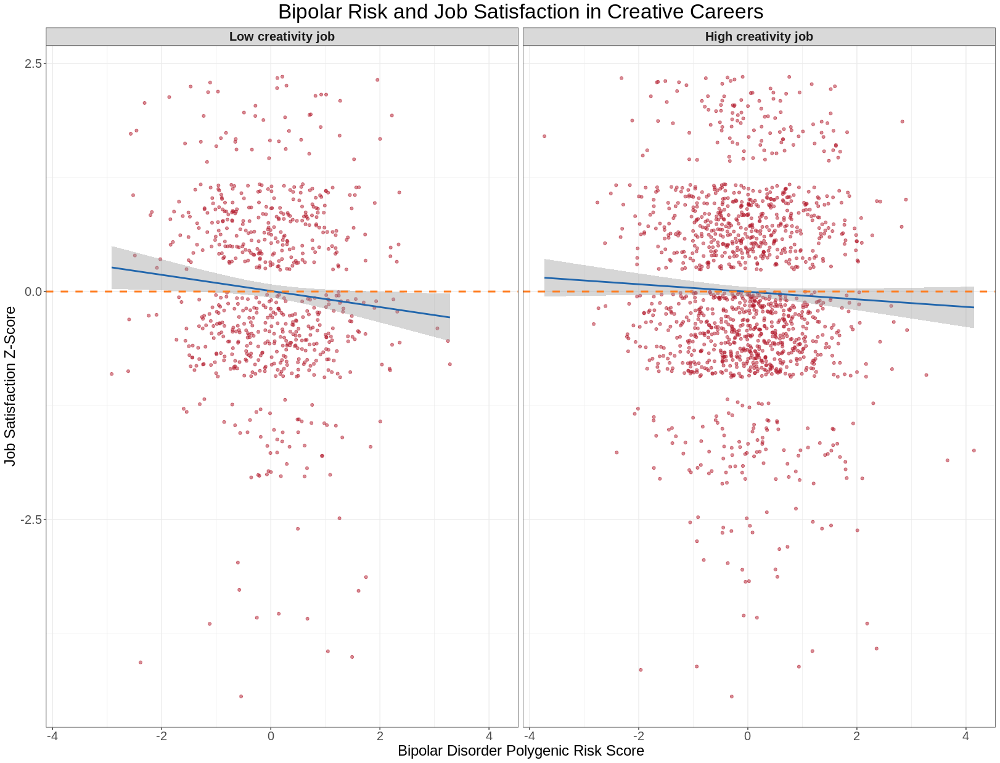

## Introduction

Creativity and bipolar disorder have had a long history of association. Many famous writers and other 'geniuses' such as Sylvia Plath and Vincent Van Gough are suspected to have had mood disorders based on anecdotal accounts of their lives. One of the first empirical studies of their relationship, spearheaded by former UI researcher Nancy Andreasen, found significantly higher rates of bipolar disorder in participants of the acclaimed Iowa Writer's Workshop compared to a control group.^1 Previous research has defined a person as 'creative' in several ways--membership in a creative organization, recognition for a creative acheivement, or most commonly, holding an arbitrarily defined "creative profession." Each of these definitions has been useful in determining the shared genetic basis of creativity and bipolar disorder.^2 Yet, these studies have failed to ask a fundamental question: are these people happier in their creative careers than elsewhere? This project will investigate the association between polygenic risk for bipolar disorder and job satisfaction in creative careers.Polygenic scores for bipolar disorder will be used for a number of reasons. First, preexisting data on cohorts with diagnosed bipolar disorderis limited. For example, twin studies, which may be a better indicator of the genetic basis between the two, are small-scale and therefore not as well-powered. Not only does the UKBiobank allow us to assess their association on a larger scale through the use of polygenic risk scores, it also gives job data which can be easily categorized as creative or non-creative, as well as job satisfaction data. Previous studies have also shown that the common genetic risk variants identified in bipolar disorder GWAS overlap with those that influence creativity.^2 These reasons make polygenic risk scores a better choice for this project.

## Methods

Job type, job satisfaction, and genotype data were collected from 32,346 individuals selected from the UKBiobank. The criteria for selection was employment at the approximate time of the job satisfaction survey (2010). These individuals were genotyped using the UKBiobank Axiom array. Genotypes were then imputed using the Haplotype Reference Consortium (HRC) and UK10K haplotype resource. Polygenic scores were calculated from genotypes using LDPred2 and were weighted using publicly available summary statistics from the most recent bipolar disorder GWAS.^3 Scores were corrected for genetic ancestry using the first ten principal components (PCs)."Creative" careers were defined as the narrowly defined artistic professions (architects, draughtspersons, artists, authors/writers, actors/entertainers, dancers and choreographers, and musicians) as determined in Kim et. al.^4 Conversely, "non-creative" careers were defined as a collection of jobs with some of the lowest creative probability scores in Bakhshi et. al.^5 *(Ask Lucas how to include these?)* Using ggplot, I created a plot comparing the relationship between bipolar PGS and job satisfaction, facetted by job creativity level, with a regression line.

## Results

## References

1. Andreasen NC. The relationship between creativity and mood disorders. Dialogues Clin Neurosci. 2008;10(2):251-255. doi:10.31887/DCNS.2008.10.2/ncandreasen
2. Power, R., Steinberg, S., Bjornsdottir, G. et al. Polygenic risk scores for schizophrenia and bipolar disorder predict creativity. Nat Neurosci 18, 953–955 (2015). https://doi.org/10.1038/nn.4040
3. Mullins, N., Forstner, A.J., O’Connell, K.S. et al. Genome-wide association study of more than 40,000 bipolar disorder cases provides new insights into the underlying biology. Nat Genet 53, 817–829 (2021). https://doi.org/10.1038/s41588-021-00857-4
4. Kim, H., Ahn, Y., Yoon, J., Jung, K., Kim, S., Shim, I., Park, T. H., Ko, H., Jung, S.-H., Kim, J., Park, S., Lee, D. J., Choi, S., Cha, S., Kim, B., Cho, M. Y., Cho, H., Kim, D. S., Ihm, H. K., … Won, H.-H. (2022). Genetic architecture of creativity and extensive genetic overlap with psychiatric disorders revealed from genome-wide association analyses of 241,736 individuals. https://doi.org/10.1101/2022.07.25.501322
5. Bakhshi, H., Frey, C.B. & Osborne, M. Creativity vs. robots. The Creative Economy and The Future of Employment. Nesta, London (2015).
